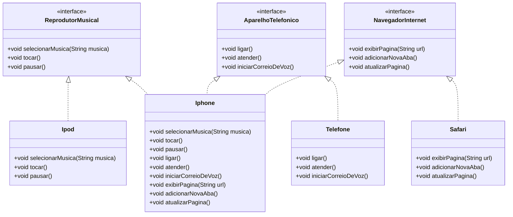

# DESAFIO POO

## Modelagem e Diagramação de um Componente iPhone

Neste desafio, modelamos e diagramos a representação UML do componente iPhone, abrangendo suas funcionalidades como Reprodutor Musical, Aparelho Telefônico e Navegador na Internet.

### Resultado do Desafio

Como sujerido, foi utilizado a ferramenta __*[Mermaid](https://mermaid.js.org/)*__ para gerar
a imagem do diagrama.

