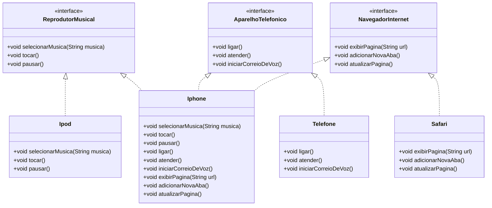

```mermaid
classDiagram
    direction TB

    class ReprodutorMusical {
        <<interface>>
        +void selecionarMusica(String musica)
        +void tocar()
        +void pausar()
    }

    class AparelhoTelefonico {
        <<interface>>
        +void ligar()
        +void atender()
        +void iniciarCorreioDeVoz()
    }

    class NavegadorInternet {
        <<interface>>
        +void exibirPagina(String url)
        +void adicionarNovaAba()
        +void atualizarPagina()
    }

    class Telefone {
        +void ligar()
        +void atender()
        +void iniciarCorreioDeVoz()
    }

    class Safari {
        +void exibirPagina(String url)
        +void adicionarNovaAba()
        +void atualizarPagina()
    }

    class Ipod {
        +void selecionarMusica(String musica)
        +void tocar()
        +void pausar()
    }

    class Iphone {
        +void selecionarMusica(String musica)
        +void tocar()
        +void pausar()
        +void ligar()
        +void atender()
        +void iniciarCorreioDeVoz()
        +void exibirPagina(String url)
        +void adicionarNovaAba()
        +void atualizarPagina()
    }

    ReprodutorMusical <|.. Ipod
    ReprodutorMusical <|.. Iphone
    AparelhoTelefonico <|.. Telefone
    AparelhoTelefonico <|.. Iphone
    NavegadorInternet <|.. Safari
    NavegadorInternet <|.. Iphone
```